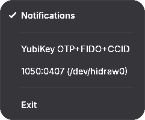

# yubi-tray-rs

A lightweight, cross-platform system tray application that monitors YubiKey connection status in real-time on Linux, macOS, and Windows.

<div align="center">
  
  &nbsp;&nbsp;&nbsp;&nbsp;
  
</div>

```text
┌─────────────────┐        ┌─────────────────┐
│  YubiKey (HID)  │        │   config.toml   │
└────────┬────────┘        └────────┬────────┘
         │ USB Poll (1s)            │ Two-way Hot-Reload
         ▼                          ▼
┌────────────────────────────────────────────┐
│                yubi-tray-rs                │
└──────────────────────┬─────────────────────┘
                       ├───> Tray Icon: Green (Connected) / Red (Disconnected)
                       ├───> Context Menu: Hardware details & Quick toggles
                       └───> Native Notifications: Custom sound & messages
```

---

## Features

- Real-time status indicator with vibrant green (connected) and red (disconnected) states
- Quick device inspection in context menu with model name and hardware identifiers
- Native desktop notifications on connect and disconnect events across all platforms
- Persistent configuration toggle for notification preferences
- Multi-platform support: Wayland/X11 (Linux), NSStatusBar (macOS), and System Tray (Windows)

---

## Installation & Download

Pre-compiled standalone binaries for all platforms and architectures are available on the [Releases](https://github.com/9hb/yubi-tray-rs/releases) page:

- **Linux**: `yubi-tray-rs-linux-x86_64`, `yubi-tray-rs-linux-arm64`
- **macOS**: `yubi-tray-rs-macos-x86_64`, `yubi-tray-rs-macos-arm64`
- **Windows**: `yubi-tray-rs-windows.exe`

---

## Building from Source

### Prerequisites

- Rust toolchain (`cargo`, `rustc` 1.80+)
- **Linux only**: `gtk3-devel`, `libappindicator-gtk3`, `libxdo-devel`, `systemd-devel`

### Build

```bash
git clone https://github.com/9hb/yubi-tray-rs.git
cd yubi-tray-rs
cargo build --release
```

The compiled binary will be located in `target/release/`.

---

## Usage

### Linux & macOS

```bash
yubi-tray-rs &
```

### Windows

Run `yubi-tray-rs-windows.exe` (starts directly in the system tray without a console window).

### Controls

Right-click the tray icon to:
- Toggle desktop notifications
- Inspect device identifiers
- Exit the application

### Configuration

The configuration file is located at:
- **Linux / macOS**: `~/.config/yubi-tray-rs/config.toml`
- **Windows**: `%APPDATA%\yubi-tray-rs\config.toml`

Example `config.toml`:

```toml
[notification]
enable = true
on_connect = true
on_disconnect = true
sound = "" # leave empty for no sound

[custom_messages]
on_connect = "YubiKey has been connected"
on_disconnect = "YubiKey has been disconnected"
```
